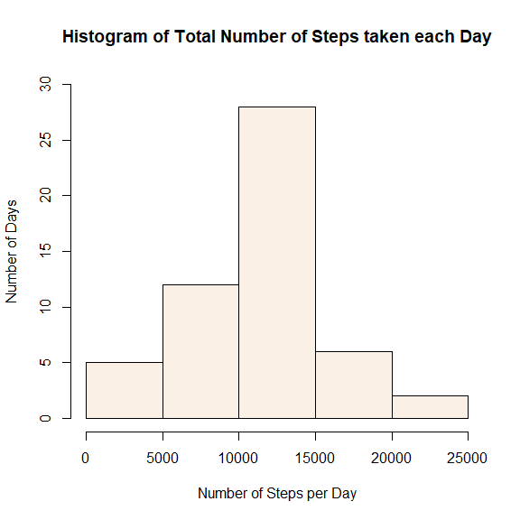
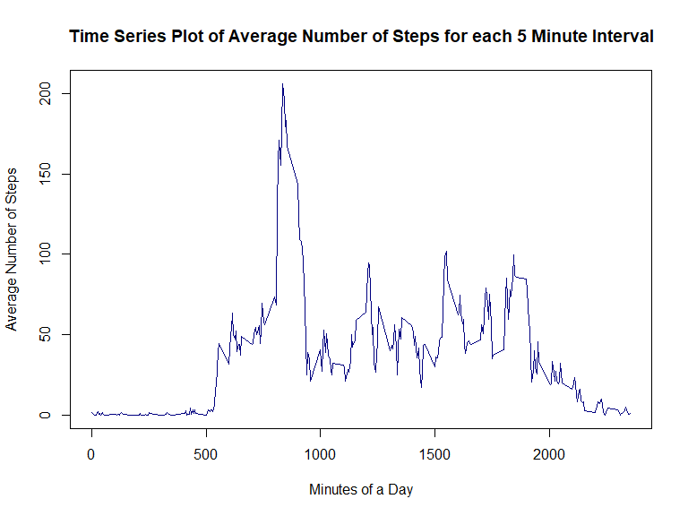
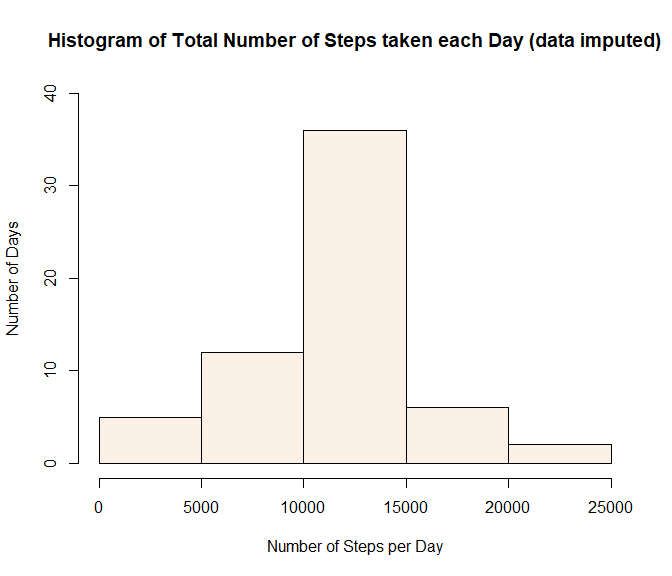
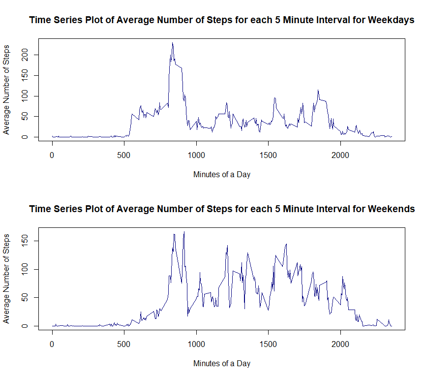

This is the R markdown file for "Course Project 1" of the "Reproducible Research" course on Coursera.

## Loading and preprocessing the data

Let's load the "knitr" package for manipulating markdown settings and the "dplyr" package for manipulating data frames.


```r
library(knitr)
library(dplyr)
```

```
## 
## Attaching package: 'dplyr'
```

```
## The following objects are masked from 'package:stats':
## 
##     filter, lag
```

```
## The following objects are masked from 'package:base':
## 
##     intersect, setdiff, setequal, union
```

Let's also create the "figures" directory if it doesn't already exist, in which we can save all our plots.


```r
if(!dir.exists("figures")) dir.create("figures")
```

We also need to set the path for figures for the "knitr" package, so that the figures show up in the markdown file.


```r
opts_chunk$set(fig.path = "./figures/")
```

Now, let's unzip the "activity.zip" file and read in the csv file as a data frame.


```r
act <- read.csv(unzip("activity.zip"))
```

Let's take a quick look at the "act" data frame.


```r
str(act)
```

```
## 'data.frame':	17568 obs. of  3 variables:
##  $ steps   : int  NA NA NA NA NA NA NA NA NA NA ...
##  $ date    : chr  "2012-10-01" "2012-10-01" "2012-10-01" "2012-10-01" ...
##  $ interval: int  0 5 10 15 20 25 30 35 40 45 ...
```

The "act" data frame has 17568 observations of 3 variables each. The variables are "steps", which contains the number of steps taken by the individual, "date", which contains the dates on which the measurements were taken, and "interval", which contains the 5 minute intervals of the days on which the measurements were taken.

We see that the data set is not devoid of missing values, which are encoded as NA. Also, the "date" variable in the "act" data frame is encoded as a character data type. So, let's convert the "date" variable into the date data type.


```r
act$date <- as.Date(act$date)
```

Let's take a quick look at the "act" data frame again.


```r
str(act)
```

```
## 'data.frame':	17568 obs. of  3 variables:
##  $ steps   : int  NA NA NA NA NA NA NA NA NA NA ...
##  $ date    : Date, format: "2012-10-01" "2012-10-01" ...
##  $ interval: int  0 5 10 15 20 25 30 35 40 45 ...
```

Since the original "date" entries were in an appropriate format, even though they were encoded as characters, R accurately converted all the dates into the "date" data type.

Let's also take a look at how the missing values are distributed in the "act" data frame.


```r
sum(is.na(act))
```

```
## [1] 2304
```

```r
sum(is.na(act$steps))
```

```
## [1] 2304
```

```r
sum(is.na(act$date))
```

```
## [1] 0
```

```r
sum(is.na(act$interval))
```

```
## [1] 0
```

It isn't too hard to conclude that all the missing values occur only in the "steps" column of the "act" data frame. So, the number of missing values in the data set is equal to the number of rows containing at least one missing value. For the rest of the analysis, we will use the "steps" variable to check whether there is a missing value or not and to obtain the number of rows that contain at least one missing value.

## What is mean total number of steps taken per day?
For this part of the analysis, we will be ignoring the missing values in the data set.

We will be performing the following tasks.

- calculate the total number of steps taken per day
- make a histogram of the total number of steps taken each day
- calculate and report the mean and the median of the total number of steps taken per day

First, let's modify the "act" data frame by filtering out missing observations, then grouping it by date and then summarizing it by calculating the number of steps for each date summed over all 5 minute intervals.


```r
actm <- summarize(group_by(filter(act, !is.na(act$steps)), date), nsteps = sum(steps))
```

Let's take a quick look at the "actm" data frame.


```r
str(actm)
```

```
## tibble [53 x 2] (S3: tbl_df/tbl/data.frame)
##  $ date  : Date[1:53], format: "2012-10-02" "2012-10-03" ...
##  $ nsteps: int [1:53] 126 11352 12116 13294 15420 11015 12811 9900 10304 17382 ...
```

We see that the "act" data frame has been summarized into the "actm" data frame which contains 53 unique dates and the corresponding total number of steps for each date. The total number of steps for each date is essentially the sum of all non-missing values of the "steps" entries over all the 5 minute intervals, for each date, which is why we grouped the "act" data frame by the "date" variable.

Now, let's plot a histogram of the total number of steps taken each day, summed over all 5 minute intervals of a day.


```r
with(actm,
     hist(nsteps,
          ylim = c(0, 30),
          xlab = "Number of Steps per Day",
          ylab = "Number of Days",
          col = "linen",
          main = "Histogram of Total Number of Steps taken each Day"))
```

<!-- -->

A quick analysis of the histogram tells us that the central tendency of the number of steps taken per day might lie somewhere between 10000 and 15000 steps per day.

Next, let's calculate the mean and median number of steps taken per day and print them.


```r
stepsmn <- round(mean(actm$nsteps), 2)
stepsmn
```

```
## [1] 10766.19
```

```r
stepsmd <- median(actm$nsteps)
stepsmd
```

```
## [1] 10765
```

The mean number of steps taken each day is 10766.19 and the median number of steps taken each day is 10765. The fact that the mean and the median are nearly equal suggests that there are extremely few outliers in the data set, if at all any.

Let's remove the data that we aren't using anymore.


```r
rm(stepsmn, stepsmd, actm)
```

## What is the average daily activity pattern?

For this part of the analysis, we will be ignoring the missing values in the data set.

We will be performing the following tasks.

- make a time series plot of the average number of steps taken per day (averaged over all days) against the 5 minute intervals of a day
- determine which 5 minute interval of the day, on average across all days, contains the maximum number of steps

First, let's modify the "act" data frame by filtering out missing observations, then grouping it by 5 minute intervals and then summarizing it by calculating the average of steps for each interval summed over all dates.


```r
actd <- summarize(group_by(filter(act, !is.na(act$steps)), interval), avsteps = mean(steps))
```

Let's take a quick look at the "actd" data frame.


```r
str(actd)
```

```
## tibble [288 x 2] (S3: tbl_df/tbl/data.frame)
##  $ interval: int [1:288] 0 5 10 15 20 25 30 35 40 45 ...
##  $ avsteps : num [1:288] 1.717 0.3396 0.1321 0.1509 0.0755 ...
```

We see that the "act" data frame has been summarized into the "actd" data frame which contains 288 unique 5 minute intervals and the corresponding average number of steps for each 5 minute interval. The average number of steps for each 5 minute interval is essentially the mean of all non-missing values of the "steps" entries over all the dates, for each 5 minute interval, which is why we grouped the "act" data frame by the "interval" variable.

Now, let's plot a time series graph of the total number of steps taken each day against the 5 minute intervals of a day, averaged over all dates.


```r
with(actd,
     plot(interval,
          avsteps,
          type = "l",
          xlab = "Minutes of a Day",
          ylab = "Average Number of Steps",
          col = "navyblue",
          main = "Time Series Plot of Average Number of Steps for each 5 Minute Interval"))
```

<!-- -->

A quick analysis of the plot tells us that the most activity occurs in the morning half of the day, while the least activity occurs at night. Interestingly, it appears that the amount of activity for the latter half of the day is more spread out as compared to the concentrated spike in the former half of the day.

Next, let's find out which 5 minute interval of the day contains the maximum average number of steps (averaged across all days) and print it.


```r
intmax <- which.max(actd$avsteps)
maxint <- actd$interval[intmax]
maxint
```

```
## [1] 835
```

```r
maxintsteps <- round(actd$avsteps[intmax], 2)
maxintsteps
```

```
## [1] 206.17
```

The maximum average number of steps is taken in the interval after 835 minutes and the maximum average number of steps is equal to 206.17

Let's remove the data that we aren't using anymore.


```r
rm(intmax, maxint, maxintsteps)
```

Note that we will need the "actd" data frame for the next part of the code.

## Imputing missing values

For this part of the analysis, we will be devising a strategy to deal with the missing values.

We will be performing the following tasks.

- calculate and report the total number of missing values in the data set
- devise a strategy for filling in all of the missing values in the data set
- create a new data set that is equal to the original data set but with the missing data filled in
- make a histogram of the total number of steps taken each day
- calculate and report the mean and the median of the total number of steps taken each day
- check whether these values differ from the first part of the assignment
- analyze and report the impact of imputing missing data on the estimates of the total daily number of steps

As we'd concluded before, since all the missing values in the "act" data frame occur only in the "steps" column, the number of missing values is equal to the number of rows with at least one missing value.

Let's calculate and report the number of missing values in the data set.


```r
nacount <- sum(is.na(act$steps))
nacount
```

```
## [1] 2304
```

```r
nacountm <- round(100 * nacount/nrow(act), 2)
nacountm
```

```
## [1] 13.11
```

There are 2304 missing values in the data set, and hence there are 2304 rows in the data set which have at least one value missing. This accounts for about 13.11 percent of the original data set.

Let's remove the data that we aren't using anymore.


```r
rm(nacount, nacountm)
```

To deal with the missing values, we will impute the missing data by replacing all the missing "steps" values for each 5 minute interval with the average number of steps for that specific 5 minute interval, averaged over all dates.

Now, let's begin by making a copy of the original "act" data frame.


```r
acti <- act
```

This is where we will be imputing the missing data.

Let's replace the missing "steps" values as described previously. Note that we need the "actd" data frame which already contains the average number of steps taken per day (averaged over all days) for each 5 minute interval, after ignoring all the missing values.


```r
for (i in 1:nrow(act))
{
  if(is.na(act$steps[i]))
  {
    acti$steps[i] <- actd[which(act$interval[i] == actd$interval), ]$avsteps
  }
}
```

Let's ensure that there are no missing values in the "acti" data frame.


```r
nacountnew <- sum(is.na(acti$steps))
nacountnew
```

```
## [1] 0
```

There are 0 missing values in the "acti" data frame.

Let's remove the data that we aren't using anymore.


```r
rm(nacountnew, i, actd, act)
```

Now, let's modify the "acti" data frame by grouping it by date and then summarizing it by calculating the number of steps for each date summed over all 5 minute intervals.


```r
actim <- summarize(group_by(acti, date), nsteps = sum(steps))
```


Now, let's plot a histogram of the total number of steps taken each day, summed over all 5 minute intervals of a day, using the imputed and summarized data frame, "actim".


```r
with(actim,
     hist(nsteps,
          ylim = c(0, 40),
          xlab = "Number of Steps per Day",
          ylab = "Number of Days",
          col = "linen",
          main = "Histogram of Total Number of Steps taken each Day (data imputed)"))
```

<!-- -->

A quick comparison of this histogram with the one from part one of the assignment shows us that any overall change in the distribution appears negligible.

Next, let's calculate the mean and median number of steps taken per day and print them.


```r
stepsmni <- round(mean(actim$nsteps), 2)
stepsmni
```

```
## [1] 10766.19
```

```r
stepsmdi <- round(median(actim$nsteps), 2)
stepsmdi
```

```
## [1] 10766.19
```

The mean number of steps taken each day is 10766.19 and the median number of steps taken each day is 10766.19. We can see that the mean has remained unchanged. This is because we have used mean values to perform the missing values imputation. The median, on the other hand, has changed slightly, now being equal to the mean.

Let's remove the data that we aren't using anymore.


```r
rm(stepsmni, stepsmdi, actim)
```

Note that we will need the "acti" data frame for the next part.

## Are there differences in activity patterns between weekdays and weekends?
For this part of the analysis, we will be using the data set with the missing values filled in, that is, the "acti" data frame.

We will be performing the following tasks.

- create a new factor variable in the data set which indicates whether the dates are weekdays or weekends
- make a panel plot containing time series plots of the average number of steps taken in each 5 minute interval, averaged across all weekdays or weekends

To perform the tasks for this part, let's first create a factor variable in the "acti" data frame which indicates whether the dates in the observations are weekdays or weekends.


```r
weekdaynames <- c("Monday", "Tuesday", "Wednesday", "Thursday", "Friday")
acti <- mutate(acti,
               daytype = factor(weekdays(acti$date) %in% weekdaynames,
                                levels = c(TRUE, FALSE),
                                labels = c("Weekday", "Weekend")))
```

Let's take a quick look at the "acti" data frame.


```r
str(acti)
```

```
## 'data.frame':	17568 obs. of  4 variables:
##  $ steps   : num  1.717 0.3396 0.1321 0.1509 0.0755 ...
##  $ date    : Date, format: "2012-10-01" "2012-10-01" ...
##  $ interval: int  0 5 10 15 20 25 30 35 40 45 ...
##  $ daytype : Factor w/ 2 levels "Weekday","Weekend": 1 1 1 1 1 1 1 1 1 1 ...
```

As we can see, the "acti" data frame now contains a new factor variable that indicates whether the dates are weekdays or weekends.

Let's remove the data that we aren't using anymore.


```r
rm(weekdaynames)
```

Now, let's modify the "acti" data frame by filtering in only the weekdays observations, then grouping it by the 5 minute intervals and then summarizing it by calculating the average number of steps for each interval, averaged over all dates.


```r
actiwd <- summarize(group_by(filter(acti, daytype == "Weekday"), interval), avsteps = mean(steps))
```

Next, let's modify the "acti" data frame by filtering in only the weekends observations, then grouping it by the 5 minute intervals and then summarizing it by calculating the average number of steps for each interval, averaged over all dates.


```r
actiwn <- summarize(group_by(filter(acti, daytype == "Weekend"), interval), avsteps = mean(steps))
```

Let's remove the data that we aren't using anymore.


```r
rm(acti)
```

Now, let's plot two time series graphs, one for weekdays and one for weekends, which plots the average number of steps for each 5 minute interval, averaged over all days (separately for weekdays and weekends).


```r
par(mfcol = c(2, 1))

with(actiwd,
     plot(interval,
          avsteps,
          type = "l",
          xlab = "Minutes of a Day",
          ylab = "Average Number of Steps",
          col = "navyblue",
          main = "Time Series Plot of Average Number of Steps for each 5 Minute Interval for Weekdays"))

with(actiwn,
     plot(interval,
          avsteps,
          type = "l",
          xlab = "Minutes of a Day",
          ylab = "Average Number of Steps",
          col = "navyblue",
          main = "Time Series Plot of Average Number of Steps for each 5 Minute Interval for Weekends"))
```

<!-- -->

A quick comparison of the two time series plots tells us a few things. Firstly, the average number of steps taken in the early hours of the day is less on weekends than on weekdays. Secondly, the average number of steps taken in the latter half of the day seems similar for both weekends and weekdays. In fact, this value might be slightly higher for the weekends.

Let's remove the data that we aren't using anymore.


```r
rm(actiwd, actiwn)
```

Finally, let's unload the "dplyr" and "knitr" packages.


```r
detach(package:dplyr)
detach(package:knitr)
```
